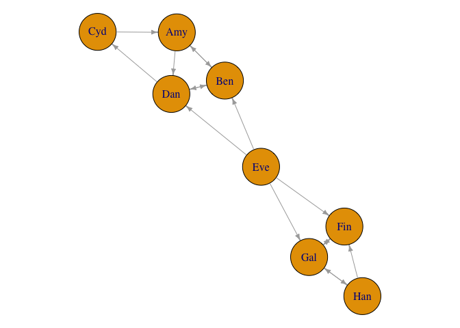
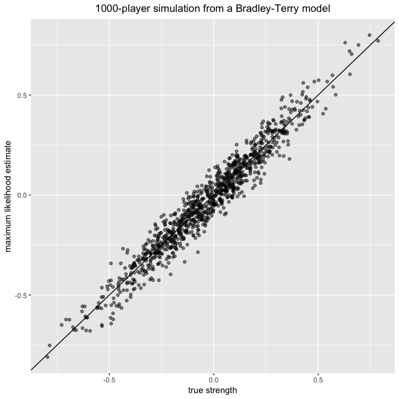

<!-- README.md is generated from README.Rmd. Please edit that file -->
BradleyTerryScalable
====================

[](https://travis-ci.org/EllaKaye/BradleyTerryScalable) [](https://cran.r-project.org/package=BradleyTerryScalable)

An R package for fitting the Bradley-Terry model to pair-comparison data, to enable statistically principled ranking of a potentially large number of objects.

Given a number of items for whick we have pair-comparison data, the Bradley-Terry model assigns a 'strength' parameter to each item. These can be used to rank the items. Moreover, they can be used to determine the probability that any given item will 'beat' any other given item when they are compared. Further details of the mathematical model, and the algorithms used to fit them, is available in the package vignette (see the end of this `README` for vignette details).

**The documentation website for this packaing can be found [here](https://ellakaye.github.io/BradleyTerryScalable/) (thanks to [`pkgdown`](https://github.com/hadley/pkgdown))**

The Bradley-Terry model
-----------------------

Details of the Bradley-Terry model are not presented here (due to GitHub's inability to display equations). Instead, please refer to the vignette [here](https://ellakaye.github.io/BradleyTerryScalable/articles/BradleyTerryScalable.html) or through the R console:

``` r
vignette("BradleyTerryScalable", package = "BradleyTerryScalable")
```

Installing the package
----------------------

``` r
# installing from CRAN
install.packages("BradleyTerryScalable")

# installing from GitHub
install.packages("devtools") # if required
devtools::install_github("EllaKaye/BradleyTerryScalable", build_vignettes = TRUE)
```

``` r
library(BradleyTerryScalable)
```

Preparing the data
------------------

The main model-fitting function in this package is `btfit()`. This function takes as its main argument an object of class `btdata`. To create a `btdata` object, use the function `btdata(x)`.

The `x` argument to `btdata` can be one of four classes of object:

-   A matrix (either a base `matrix` or a class from the `Matrix` package), dimension *K* by *K*, where *K* is the number of items. The *i*, *j*-th element is *w*<sub>*i**j*</sub>, the number of times item *i* has beaten item *j*. Ties can be accounted for by assigning half a win (i.e. 0.5) to each item.

-   A contingency table of class `table`, similar to the matrix described in the above point.

-   An `igraph`, representing the *comparison graph*, with the *K* items as nodes. For the edges:
    -   If the graph is unweighted, a directed edge from node *i* to node *j* for every time item *i* has beaten item *j*
    -   If the graph is weighted, then one edge from node *i* to node *j* if item *i* has beaten item *j* at least once, with the weight attribute of that edge set to the number of times *i* has beaten *j*.
-   A data frame (`data.frame` or `tibble`), with three or four columns
    -   If the data frame has three columns, then the first column must be the name of the first item, the second column must be the name of the second item, and the third column must be the number of times the first item has beaten the second item.
    -   If the data frame has four columns, then the first column must be the name of the first item, the second column must be the name of the second item, and the third column must be the number of times the first item has beaten the second item and the fourth column must be the number of times the second item has beaten the first item.
    -   In either of these cases, the data can be aggregated, or there can be one row per comparison.
    -   Ties can be accounted for by assigning half a win (i.e. 0.5) to each item.

We anticipate that the user may have data in a three-column data frame that does not match the description of the three-column data frame above. For example, the data frame could have one row per comparison, where the third column contains a code to indicate which of the two items won, say `W1` if the item in column 1 won, `W2` if the item in column 2 won and `D` if it was a tie/draw. Alternatively, the third column could contain the win-count, but only relative to the first item, i.e. 1 if the first item wins, 0 if it loses and 0.5 if there was a draw. In this case, the `btdata` function won't know that a loss for the first item item should be counted as a win for the second item.

For the cases described in the previous paragraph, the `BradleyTerryScalable` package provides the `codes_to_counts()` function, which takes such three-column data-frames and returns a four-column data frame of the required format for passing to the `btdata()` function.

The `BradleyTerryScalable` package provides two toy data sets which we'll use in this demonstration:

``` r
data(citations) 
citations
#>               citing
#> cited          Biometrika Comm Statist JASA JRSS-B
#>   Biometrika          714          730  498    221
#>   Comm Statist         33          425   68     17
#>   JASA                320          813 1072    142
#>   JRSS-B              284          276  325    188
data(toy_data)
toy_data
#>    player1 player2 outcome
#> 1      Cyd     Amy      W1
#> 2      Amy     Ben       D
#> 3      Ben     Eve      W2
#> 4      Cyd     Dan      W2
#> 5      Ben     Dan       D
#> 6      Dan     Eve      W2
#> 7      Fin     Eve      W2
#> 8      Fin     Gal      W2
#> 9      Fin     Han      W2
#> 10     Eve     Gal      W1
#> 11     Fin     Gal       D
#> 12     Han     Gal      W1
#> 13     Han     Gal      W2
#> 14     Amy     Dan      W1
#> 15     Cyd     Amy      W1
#> 16     Ben     Dan       D
#> 17     Dan     Amy      W2
```

`citations` is in an appropriate format to pass to `btdata()`, whereas `toy_data` needs to be passed through `codes_to_counts()` first:

``` r
citations_btdata <- btdata(citations)
toy_data_4col <- codes_to_counts(toy_data, c("W1", "W2", "D"))
toy_btdata <- btdata(toy_data_4col, return_graph = TRUE) 
```

A `btdata` object is a list containing two or three elements:

-   `wins`: a matrix of the form described in the second bullet point above
-   `components`: a list of the fully-connected components of the comparison graph (see the third bullet point above)
-   `graph`: if `return_graph = TRUE`, then the `igraph` object of the comparison graph is returned, which can be useful for visualising the data.

``` r
library(igraph)
par(mar = c(0, 0, 0, 0) + 0.1)  
plot.igraph(toy_btdata$graph, vertex.size = 28, edge.arrow.size = 0.5) 
```



Information about the `btdata` objects can be seen through the `summary.btdata()` method:

``` r
summary(citations_btdata)
#> Number of items: 4 
#> Density of wins matrix: 1 
#> Fully-connected: TRUE
summary(toy_btdata)
#> Number of items: 8 
#> Density of wins matrix: 0.25 
#> Fully-connected: FALSE 
#> Number of fully-connected components: 3 
#> Summary of fully-connected components: 
#>   Component size Freq
#> 1              1    1
#> 2              3    1
#> 3              4    1
```

Note that components of size 1 will be filtered out in the MLE fit (see next section); the model doesn't make sense for them.

`select_components()` can be used to create a subset of a `btdata` object. In our toy case, the following all give the same subset:

``` r
toy_btdata_subset <- select_components(toy_btdata, "3")
toy_btdata_subset <- select_components(toy_btdata, function(x) length(x) == 4)
toy_btdata_subset <- select_components(toy_btdata, function(x) "Cyd" %in% x)
summary(toy_btdata_subset)
#> Number of items: 4 
#> Density of wins matrix: 0.4375 
#> Fully-connected: TRUE
```

Alternatively, set the `subset` argument in `btfit()`.

Fitting the model
-----------------

`summary.btdata(object)` gives information on whether or not the underlying comparison graph is fully connected. This affects the type of estimate available for the strength parameter.

-   If the comparison graph is fully connected (i.e. if `Fully-connected: TRUE` is printed), then the maximum likelihood estimate (MLE) for the Bradley-Terry model exists and is finite.
-   If the comparison graph is not fully connected (i.e. if `Fully-connected: FALSE` is printed), then we cannot find the MLE for the full dataset. There are two alternatives:
    -   Find the MLE on each fully connected component of the comparison graph (and note then that it is only meaningful to rank and compare items within the same component).
    -   Place a Bayesian prior on the model, then find the maximum a posteriori (MAP) estimate. This always exists and is finite. It gives a principled way of ranking and comparing all *K* items.

The function `btfit()` requires two arguments: the data (in the form of a `btdata` oject), and `a`, which controls whether the MLE or MAP estimate is returned.

-   If `a = 1`, the MLE is returned, either on the full dataset if the comparison graph is fully-connected, or else the MLE is found separately for each fully-connected component.
-   If `a > 1`, the MAP estimate is returned, with `a` as the value of the shape parameter in the prior.

See `?btfit()` or the *Fitting the Bradley-Terry model* section above for more details.

``` r
citations_fit <- btfit(citations_btdata, 1)
toy_fit_MLE <- btfit(toy_btdata, 1)
toy_fit_MAP <- btfit(toy_btdata, 1.1)
```

`btfit` objects are lists, and they are not designed to be examined directly, but to be passed to other methods.

Methods for a `btfit` object
----------------------------

### `summary.btfit()`, `coef.btfit()` and `vcov.btfit()`

The `summary.btfit()` method returns a list with

-   `call`: the call to `btfit()`
-   `item_summary`: a data frame with one row for each item in the fit (note that this can be fewer than the number of items in the data, if there were any components of size one, or if the fit was on a subset). Items are ranked in descending order *within each component*
-   `component_summary`: a data frame with one row per component in the fit.

The standard errors are *not* returned by default (since the underlying `vcov.btfit()` function can be slow for large matrices), but can be included by setting `SE = TRUE`. It is also possible to set a reference item, and to return the summary for only a subset of components (see `?summary.btfit()`).

The `coef.btfit()` method extracts the parameter estimates. This is the strength parameter, on the log scale, constrained (by default) such that the mean of the estimates is zero. By default it is a vector if `btfit()` was run on the full dataset, or a list of vectors otherwise, but there is also the possibility of returning a data frame by setting `as_df = TRUE`.

The `vcov.btfit()` method returns the variance-covariance matrix (or a list of these matrices by component), and also has `ref` and `subset` arguments (see `?vcov.btfit()`).

``` r
summary(citations_fit)
#> $call
#> btfit(btdata = citations_btdata, a = 1)
#> 
#> $item_summary
#> # A tibble: 4 x 3
#>      component         item   estimate
#>          <chr>        <chr>      <dbl>
#> 1 full_dataset       JRSS-B  1.0604065
#> 2 full_dataset   Biometrika  0.7897537
#> 3 full_dataset         JASA  0.3095638
#> 4 full_dataset Comm Statist -2.1597241
#> 
#> $component_summary
#> # A tibble: 1 x 4
#>      component num_items iters converged
#>          <chr>     <int> <int>     <lgl>
#> 1 full_dataset         4     2      TRUE
summary(toy_fit_MLE, SE = TRUE)
#> $call
#> btfit(btdata = toy_btdata, a = 1)
#> 
#> $item_summary
#> # A tibble: 7 x 4
#>   component  item    estimate        SE
#>       <chr> <chr>       <dbl>     <dbl>
#> 1         2   Han  0.69564153 0.9110076
#> 2         2   Gal  0.41253614 0.7675914
#> 3         2   Fin -1.10817768 1.0499275
#> 4         3   Cyd  0.59239992 0.9905958
#> 5         3   Amy  0.03250119 0.6990438
#> 6         3   Ben -0.24307179 0.9443103
#> 7         3   Dan -0.38182932 0.7124240
#> 
#> $component_summary
#> # A tibble: 2 x 4
#>   component num_items iters converged
#>       <chr>     <int> <int>     <lgl>
#> 1         2         3     6      TRUE
#> 2         3         4    10      TRUE
coef(toy_fit_MAP)
#>         Eve         Cyd         Han         Amy         Gal         Ben 
#>  1.90113420  0.47237293  0.24535391 -0.07655328 -0.10175687 -0.42296697 
#>         Dan         Fin 
#> -0.53638389 -1.48120003
vcov(citations_fit, ref = "JASA")
#> 4 x 4 sparse Matrix of class "dgCMatrix"
#>               citing
#> cited               JRSS-B  Biometrika JASA Comm Statist
#>   JRSS-B       0.005323938 0.001988435    .  0.001172936
#>   Biometrika   0.001988435 0.003671841    .  0.001396292
#>   JASA         .           .              .  .          
#>   Comm Statist 0.001172936 0.001396292    .  0.009638953
```

### `btprob()` and `fitted.btfit()`

The `btprob` function calculates the Bradley-Terry probabilities that item *i* beats item *j*. By default the result is a matrix if `btfit` was run on the full dataset, or a list of matrices otherwise, but there is also the possibility of returning a data frame by setting `as_df = TRUE`. The `fitted.btfit()` method functions similarly, except it returns the expected number of wins (see `?fitted.btfit()`).

``` r
btprob(citations_fit)
#> 4 x 4 sparse Matrix of class "dgCMatrix"
#>               citing
#> cited              JRSS-B Biometrika       JASA Comm Statist
#>   JRSS-B       .           0.5672532 0.67936229    0.9615848
#>   Biometrika   0.43274683  .         0.61779270    0.9502388
#>   JASA         0.32063771  0.3822073 .             0.9219605
#>   Comm Statist 0.03841516  0.0497612 0.07803945    .
fitted(toy_fit_MLE, as_df = TRUE)
#> # A tibble: 8 x 5
#>   component player1 player2      fit1      fit2
#>       <chr>   <chr>   <chr>     <dbl>     <dbl>
#> 1         2     Han     Gal 1.1406148 0.8593852
#> 2         2     Han     Fin 0.8586132 0.1413868
#> 3         2     Gal     Fin 1.6412871 0.3587129
#> 4         3     Cyd     Amy 1.2728582 0.7271418
#> 5         3     Amy     Ben 0.5684605 0.4315395
#> 6         3     Cyd     Dan 0.7259617 0.2740383
#> 7         3     Amy     Dan 1.2042516 0.7957484
#> 8         3     Ben     Dan 1.0692677 0.9307323
```

### `simulate.btfit()` and `simulate_BT()`

There are two functions to simulate data from a Bradley-Terry model. The S3 method `simulate.btfit()` takes a `btfit` object *which has been fitted on one component* (either the full dataset, or a one-component subset). The underlying function `simulate_BT()` takes an `N` matrix (i.e. where the *i*, *j*-th element is the number of times items *i* and *j* have been compared) and a vector `pi`, the strength parameters of a Bradley-Terry model (note that `pi` is *not* the same as the estimates in `coef.btfit()` and `summary.btfit()`, which are on the logarithmic scale). Both functions return a `wins` matrix by default, but can also be set to return a `btdata` object instead.

For example, we can simulate 100 new datasets from the fitted model for the small `citations` dataset:

``` r
citations_sim <- simulate(citations_fit, nsim = 100, seed = 1)
citations_sim[1:2]
#> $sim_1
#> 4 x 4 sparse Matrix of class "dgCMatrix"
#>               citing
#> cited          JRSS-B Biometrika JASA Comm Statist
#>   JRSS-B            .        286  316          285
#>   Biometrika      219          .  495          725
#>   JASA            151        323    .          817
#>   Comm Statist      8         38   64            .
#> 
#> $sim_2
#> 4 x 4 sparse Matrix of class "dgCMatrix"
#>               citing
#> cited          JRSS-B Biometrika JASA Comm Statist
#>   JRSS-B            .        291  315          273
#>   Biometrika      214          .  511          723
#>   JASA            152        307    .          811
#>   Comm Statist     20         40   70            .
```

As a bigger example, let's simulate a single instance of a fairly sparse tournament with 1000 items (or 'players'), and then fit the Bradley-Terry model to the resulting data:

``` r
library(Matrix)
library(dplyr)
library(ggplot2)
set.seed(1989)
n_items <- 1000

## Generate at random a sparse, symmetric matrix of binomial totals: 
Nvalues <- rpois(n = n_items * (n_items - 1) / 2, lambda = 1)  
notzero <- Nvalues > 0
Nmatrix <- Matrix(nrow = n_items, ncol = n_items)
ij <- which(lower.tri(Nmatrix), arr.ind = TRUE)[notzero, ]
Nmatrix <- sparseMatrix(
             i = ij[, 1],
             j = ij[, 2],  
             x = Nvalues[notzero],
             symmetric = TRUE,   
             dims = c(n_items, n_items)) 

## Generate at random the (normalized to mean 1) 'player abilities':
pi_vec <- exp(rnorm(n_items) / 4)
pi_vec <- pi_vec / mean(pi_vec)

## Now generate contest outcome counts from the Bradley-Terry model:
big_matrix <- simulate_BT(pi_vec, Nmatrix, nsim = 1, seed = 1)[[1]]
big_btdata <- btdata(big_matrix)

## Fit the Bradley-Terry model to the simulated data:
the_model <- btfit(big_btdata, a = 1)
pi_fitted <- the_model $ pi $ full_dataset

## Plot fitted vs true abilities:
plot_df <- tibble(x = log(pi_vec[as.numeric(names(pi_fitted))]),
                  y = log(pi_fitted))

ggplot(plot_df, aes(x, y)) +
  geom_point(alpha = 0.5) +
  geom_abline() + 
  xlab("true strength") +
  ylab("maximum likelihood estimate") +
  ggtitle("1000-player simulation from a Bradley-Terry model") +
  theme(plot.title = element_text(hjust = 0.5))
```



Further information
-------------------

All code for the package is available at <https://github.com/EllaKaye/BradleyTerryScalable> and a documentation website is available at <https://ellakaye.github.io/BradleyTerryScalable>
